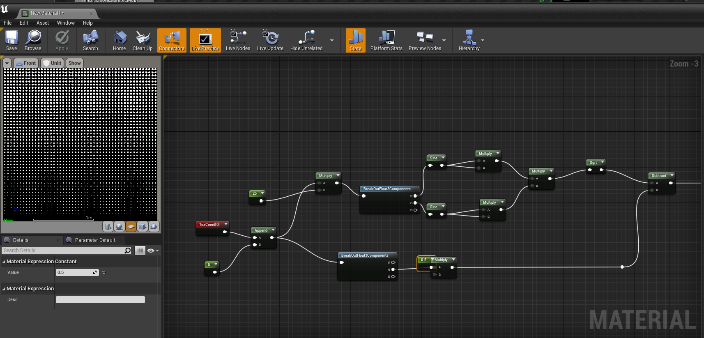

# bl_mats_copy_ue
bl_mats_copy_ue is an add-on for copying Blender material nodes to UnrealEngine.

## Install

Download the add_on and extract to your blender addons folder, or you can just install in Blender with zip file.

## Usage
Go to Blender -> Edit -> Preferences -> Add-ons: Search "copy", find the "Material Nodes Copy to UE" add-on, click the "Install Pyperclip" button.

Select shader nodes what you want to paste to Unreal material, find "CP" in Shader Node Editor Panel. 

Switch to CP2U Panel and click "Copy" button.

Go to UE material and press paste shotcut (Ctrl + V).

## Supported Nodes

Because of the limitation of **clipboard** and the **Render differences** between Blender and UE, this addon can't copy some node like **Shader**, **Image**, some special **attributes** in blender and so on...

And be aware that all texcoord nodes are float2 in UE but float3 in Blender. You need to append a value for texcoord.

### Symbol Meannig

✅Yes : Totally Supported.

⚠️Part : Only some functions are supported or defective.

🚷Todo : Waiting for development.

❌No : Not supported at all.

### Input
| Blender Node | Is Supported |
| ---- | ---- |
| Ambient Occlusion | ❌ |
| Attribute | ⚠️ |
| Bevel | ❌ |
| Camera Data | ⚠️ |
| Fresnel | ✅ |
| Geometry | ⚠️ |
| Hair Info | ❌ |
| Layer Weight | ⚠️ |
| Light Path | ❌ |
| Object Info | ⚠️ |
| Particle Info | ❌ |
| Point Info | ❌ |
| RGB | ✅ |
| Texcoordinate | ⚠️ |
| UVMap | ⚠️ |
| Value | ✅ |
| Vertex Color | ⚠️ |
| Volume Info | ❌ |
| Wireframe | ❌ |

### Output

❌No

### Shader

❌No

### Texture

🚷Todo

### Color

| Blender Node | Is Supported |
| ---- | ---- |
| Bright Contrast | 🚷 |
| Gamma | ✅ |
| Hue/Saturation | 🚷 |
| Invert | 🚷 |
| Light Falloff | ❌ |
| MixRGB | ✅ |
| RGB Curves | ❌ |

### Vector

| Blender Node | Is Supported |
| ---- | ---- |
| Bump | 🚷 |
| Displacement | ❌ |
| Mapping | ✅ |
| Normal | ❌ |
| Normal Map | ❌ |
| Vector Curve | ❌ |
| Vector Displacement | ❌ |
| Vector Rotate | 🚷 |
| Vector Transform | ⚠️ |

### Converter

| Blender Node | Is Supported |
| ---- | ---- |
| Black Body | ✅ |
| Clamp | ✅ |
| ColorRamp | ❌ |
| Combine HSV | 🚷 |
| Combine RGB | ✅ |
| Combine XYZ | ✅ |
| Float Curves | ❌ |
| Map Range | 🚷 |
| Math | ⚠️ |
| RGB to BW | ✅ |
| Separate HSV | 🚷 |
| Separate RGB | ✅ |
| Separate XYZ | ✅ |
| Shader to RGB | ❌ |
| Vector Math | ⚠️ |
| Wave Length | 🚷 |

### Script

❌No

### Group

❌No

You can create a material function.

### Layout

| Blender Node | Is Supported |
| ---- | ---- |
| Frame | 🚷 |
| Reroute | ✅ |

