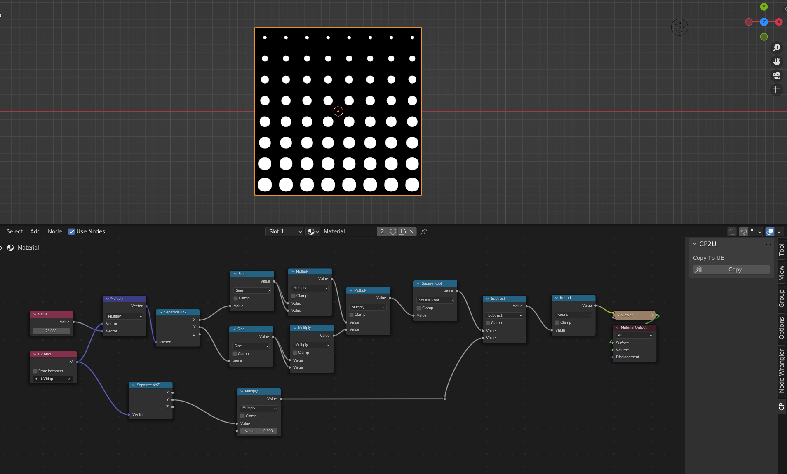
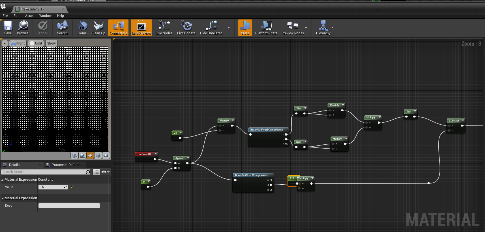

# bl_mats_copy_ue

bl_mats_copy_ue是一个可以把Blender材质节点复制粘贴到虚幻引擎的插件。

## 安装

下载插件源码或在Release中下载打包好的压缩包解压到Blender插件文件，也可以直接在Blender内安装zip文件。

## 使用

在 Blender -> 编辑 -> 首选项 -> 插件 中搜索“copy”，找到"Material Nodes Copy to UE"插件，点击"Install Pyperclip"按钮。这会安装和剪切板相关的python库。

选择你想粘贴到UE的材质节点，在侧边面板“CP”栏处找到CP2U面板并点击“Copy”按钮即可。

到UE材质界面中粘贴。

## 支持的节点

由于**剪切板的限制**和Blender与UE之间渲染机制**不同**，该插件无法复制如 **Shader**、**Image**、一些Blender节点中特有的**特殊属性**等等。。。

并且要注意UE中的texcoord节点输出类型为float2，Blender中的texture coordinate和uvmap都为float3。所以你或许需要在复制到UE后为该节点增加一个append vector节点。

### 符号含义

✅支持 : 完全支持。

⚠️部分 : 节点中的某些输出或者功能无法实现。

🚷计划 : 等待或正在开发中。

❌不支持 : 无意义或完全不支持。

### 输入
| Blender 节点 | 是否支持 |
| ---- | ---- |
| 环境光遮蔽(AO) | ❌ |
| 属性 | ⚠️ |
| 倒角 | ❌ |
| 摄像机数据 | ⚠️ |
| 菲涅尔 | ✅ |
| 几何数据 | ⚠️ |
| 毛发信息 | ❌ |
| 层权重 | ⚠️ |
| 光程 | ❌ |
| 物体信息 | ⚠️ |
| 粒子信息 | ❌ |
| 点信息 | ❌ |
| RGB | ✅ |
| 纹理坐标 | ⚠️ |
| UV贴图 | ⚠️ |
| 值(明度) | ✅ |
| 顶点颜色 | ⚠️ |
| 体积信息 | ❌ |
| 线框 | ❌ |

### 输出

❌不支持

### 着色器

❌不支持

### 纹理

🚷计划

### 颜色

| Blender 节点 | 是否支持 |
| ---- | ---- |
| 亮度对比度 | 🚷 |
| 伽马 | ✅ |
| 色相/饱和度 | 🚷 |
| 反转 | 🚷 |
| 光线衰减 | ❌ |
| 混合RGB | ✅ |
| RGB 曲线 | ❌ |

### 矢量

| Blender 节点 | 是否支持 |
| ---- | ---- |
| 凹凸 | 🚷 |
| 置换 | ❌ |
| 映射 | ✅ |
| 法向 | ❌ |
| 法向贴图 | ❌ |
| 矢量曲线 | ❌ |
| 矢量置换 | ❌ |
| 矢量旋转 | 🚷 |
| 矢量变换 | ⚠️ |

### 转换器

| Blender 节点 | 是否支持 |
| ---- | ---- |
| 黑体 | ✅ |
| 钳制 | ✅ |
| 颜色渐变 | ❌ |
| 合并 HSV | 🚷 |
| 合并 RGB | ✅ |
| 合并 XYZ | ✅ |
| 浮点曲线 | ❌ |
| 映射范围 | 🚷 |
| 运算 | ⚠️ |
| RGB -> BW | ✅ |
| 分离 HSV | 🚷 |
| 分离 RGB | ✅ |
| 分离 XYZ | ✅ |
| Shader -> RGB | ❌ |
| 矢量运算 | ⚠️ |
| 波长 | 🚷 |

### 脚本

❌不支持

### 群组

❌不支持

你可以创建一个材质函数来替代。

### 布局

| Blender 节点 | 是否支持 |
| ---- | ---- |
| 框 | 🚷 |
| 转接点 | ✅ |